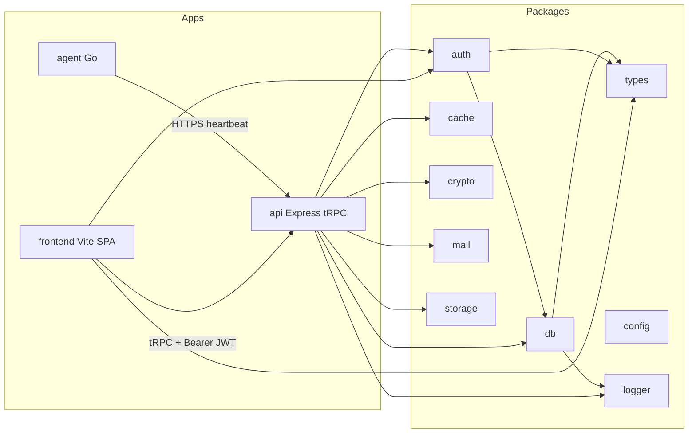

# Orvex Monitor Scaffold

> **For agentic workers:** REQUIRED SUB-SKILL: Use superpowers:subagent-driven-development (recommended) or superpowers:executing-plans to implement this plan task-by-task. After the user confirms, write this plan to [`docs/superpowers/plans/2026-08-22-orvex-monitor-scaffold.md`](docs/superpowers/plans/2026-08-22-orvex-monitor-scaffold.md) and execute from that file. Fresh subagent per task, review after each, sequential only (never parallel implementers).

**Goal:** Initialize a git-tracked pnpm/Turborepo monorepo that lints, typechecks, and builds, with working package APIs (env-gated) and app shells — not the monitoring product yet.

**Architecture:** Shared `@orvex/*` libraries sit under `packages/`. The Vite SPA talks to the Express API over tRPC with Supabase JWTs in `Authorization: Bearer`. The Go agent is a Turbo-wrapped module (`package.json` scripts calling `go`), not TypeScript. Identity is **Supabase Auth only** — no custom tokens, no `express-session`.

**Tech Stack:** pnpm 11 + catalogs, Turborepo 2.10, TypeScript 7 (typecheck) + TypeScript 6 (eslint API), ESLint 10, Prettier 3, tsdown 0.22, Vite 8, React 19, React Router 7 (library/SPA), TanStack Query, Zustand, Recharts, shadcn/ui (Radix, New York), Tailwind v4, motion, Express, tRPC 11, Zod 4, Winston+Chalk, Nodemailer, ioredis, Supabase JS, Go 1.26.

## Global Constraints

- Workspace scope is `@orvex/*` (`@orvex/types`, `@orvex/config`, `@orvex/auth`, `@orvex/logger`, `@orvex/mail`, `@orvex/storage`, `@orvex/crypto`, `@orvex/db`, `@orvex/cache`, `@orvex/frontend`, `@orvex/api`, `@orvex/agent`).
- Auth is Supabase Auth only. `packages/auth` is a typed wrapper around `@supabase/supabase-js` Auth. API verifies JWTs with `auth.getUser(jwt)` — never `getSession()` on the server. No `express-session`.
- Shared types live in `@orvex/types`. Package-specific types live in that package's `src/types`. No `any`. Avoid `unknown` except where TypeScript requires it (e.g. `catch`); wrap those in typed helpers.
- TypeScript 7 has no stable programmatic API. Pin the `typescript` package name to `@typescript/typescript6` (for typescript-eslint). Install TypeScript 7 as the alias `typescript-native` (`npm:typescript@^7`). `typecheck` scripts must invoke the TS7 binary (`node_modules/typescript-native/bin/tsc --noEmit`). `tsc` used by ESLint stays on TS6.
- ESLint v10+ flat config only. Prettier for formatting (no formatting rules in ESLint). All packages/apps must pass `lint` and `typecheck`.
- Packages and the API build with tsdown (clean `dist/` first; prod uses `minify: true`, `dts: true`, `treeshake` default on). Frontend builds with Vite 8. Agent builds with `go build`.
- Every workspace `package.json` has `dev`, `build`, `clean`, `lint`, `typecheck`, `test`. Root scripts only delegate to `turbo run`.
- Node `>=22`. Go `1.26`. pnpm via `packageManager`. Use pnpm catalogs so versions are not duplicated.
- Frontend: dark theme default (Tailwind `neutral` + cyan accents); light theme uses a darker blue accent; animated theme switch via `motion`. Routes compose components — no fat page files.
- Follow Vercel React best practices: no barrel-file re-exports of UI, dynamic-import Recharts, parallel fetches, no components defined inside components.
- Commits after every task. Do not push. Do not commit `.env`. Scaffold on `main` (empty repo, user requested git init here).
- This plan is **scaffold only**: health/auth-me procedures, theme shell, agent heartbeat stub. No monitors, alerting, billing, or RAID collectors beyond typed stubs.

## Confirmed product/tooling decisions

- **Dropped:** custom token issuer and `express-session` (user chose Supabase Auth only).
- **Kept:** `packages/auth` as the typed Supabase Auth wrapper so apps do not import `@supabase/supabase-js` ad hoc.
- **Frontend:** Vite 8 SPA + `createBrowserRouter` (not React Router framework/SSR).
- **Rate limiting:** still on Express (`express-rate-limit`); Redis store later via `@orvex/cache` when `REDIS_URL` is set, memory store otherwise.

## Target tree

```
orvex-monitor/
  apps/
    frontend/          @orvex/frontend   Vite 8 + React
    api/               @orvex/api        Express + tRPC
    agent/             @orvex/agent      Go 1.26
  packages/
    types/             @orvex/types
    config/            @orvex/config
    logger/            @orvex/logger
    crypto/            @orvex/crypto
    cache/             @orvex/cache
    db/                @orvex/db
    auth/              @orvex/auth
    mail/              @orvex/mail
    storage/           @orvex/storage
```



## TypeScript 7 + ESLint 10 (required pattern)

Root catalog:

```yaml
catalog:
  typescript: npm:@typescript/typescript6@6.0.2
  typescript-native: npm:typescript@^7.0.2
  eslint: ^10.9.0
  typescript-eslint: ^8.63.0
```

Every TS package:

```json
"scripts": {
  "typecheck": "node ../../node_modules/typescript-native/bin/tsc --noEmit -p tsconfig.json"
}
```

(Adjust relative path: from `apps/*` and `packages/*` both are two levels up. Prefer a small `@orvex/config` bin `orvex-tsc` that wraps the TS7 binary so paths stay stable.)

## Shared package script and tsdown contract

Each library `package.json`:

```json
{
  "type": "module",
  "exports": {
    ".": {
      "types": "./dist/index.d.ts",
      "import": "./dist/index.js"
    }
  },
  "files": ["dist"],
  "scripts": {
    "clean": "rm -rf dist",
    "dev": "tsdown --watch",
    "build": "pnpm clean && tsdown",
    "lint": "eslint .",
    "typecheck": "orvex-tsc --noEmit -p tsconfig.json",
    "test": "vitest run"
  }
}
```

Shared tsdown preset from `@orvex/config/tsdown/node`:

```ts
export const nodeLibrary = {
  entry: ["src/index.ts"],
  platform: "node" as const,
  format: ["esm" as const],
  dts: true,
  clean: true,
  minify: process.env.NODE_ENV === "production",
  sourcemap: true,
  treeshake: true,
}
```

Dev builds omit minify (`NODE_ENV` unset). Prod `turbo build` sets minify via the preset reading `NODE_ENV` or a `--minify` flag in the `build` script: `pnpm clean && tsdown --minify`.

## Task graph (sequential SDD)

Later tasks consume only the **Interfaces** of earlier ones. Do not re-read the whole plan into later dispatches — use `scripts/task-brief`.

### Task 1: Git + root workspace

**Files:** Create `.gitignore`, `.env.example`, `.node-version` (`22`), `package.json`, `pnpm-workspace.yaml`, `turbo.json`, `tsconfig.json`, `prettier.config.js`, `.prettierrc` via config later, `README.md`, `docs/superpowers/plans/2026-08-22-orvex-monitor-scaffold.md`

**Produces:** git repo on `main`; `packageManager: "pnpm@11.16.0"`; catalogs for typescript, typescript-native, eslint, prettier, tsdown, turbo, zod, vitest, react, etc.; turbo tasks `build` (`dependsOn: ["^build"]`, outputs `dist/**`), `dev` (persistent, no cache), `lint`, `typecheck` (`dependsOn: ["^build"]`), `test`, `clean`.

- [ ] `git init`, first commit: ignore + README
- [ ] Root manifests + turbo + catalogs
- [ ] Commit `chore: initialize pnpm turborepo workspace`

### Task 2: `@orvex/config`

**Files:** `packages/config/package.json`, `src/eslint/base.ts`, `src/eslint/node.ts`, `src/eslint/react.ts`, `src/prettier.ts`, `src/tsdown/node.ts`, `src/bin/orvex-tsc.ts` (or a tiny `bin/orvex-tsc.mjs` that spawns TS7), `tsconfig/base.json`, `tsconfig/node.json`, `tsconfig/react.json`

**Produces:**

- `baseEslintConfig`, `nodeEslintConfig`, `reactEslintConfig` (typed lint, `no-explicit-any` error, import type, unicorn/unused-imports as appropriate for ESLint 10)
- Prettier 3 export
- `orvex-tsc` bin pointing at `typescript-native`
- tsconfig bases: `strict`, `noUncheckedIndexedAccess`, `exactOptionalPropertyTypes`, `verbatimModuleSyntax`, `module`/`moduleResolution` `nodenext` (react app uses `bundler`)

Config package must lint/typecheck/build itself.

### Task 3: `@orvex/types`

**Files:** `packages/types/src/index.ts`, `src/auth.ts`, `src/user.ts`, `src/organization.ts`, `src/monitor.ts`, `src/agent.ts`, `src/database.ts`, `src/storage.ts`, `src/mail.ts`, `src/result.ts`

**Produces (verbatim names later tasks import):**

- `Result<T, E extends Error = Error> = { ok: true; value: T } | { ok: false; error: E }`
- `AuthUser { id: string; email: string; emailConfirmedAt: string | null }`
- `Organization { id: string; name: string; slug: string }`
- `MonitorType = "http" | "keyword" | "ping" | "port" | "heartbeat" | "agent"`
- `AgentMode = "daemon" | "cron"`
- `AgentHeartbeatPayload` (id, version, metrics stub)
- `Database` empty Supabase schema stub (`public.Tables` record type) until `supabase gen types`
- `StorageDriver = "s3" | "local"`
- No runtime code except type-only module; still emit `.d.ts` via tsdown

### Task 4: `@orvex/logger`

**Consumes:** `@orvex/types`, `@orvex/config`

**Produces:** `createLogger(options: { service: string }): OrvexLogger` with `info/warn/error/debug/child`. Winston transports + Chalk for TTY. Never logs secrets (redact `Authorization`, `apikey`, `password`).

**Test:** child logger includes `service`; redact test.

### Task 5: `@orvex/crypto`

**Produces:** `encrypt(plaintext: string, key: Uint8Array): string` / `decrypt(payload: string, key: Uint8Array): string` using AES-256-GCM; `randomKey(): Uint8Array`; `hashPassword` is **out of scope** (Supabase Auth). Typed errors `CryptoError`.

**Test:** roundtrip; garbage ciphertext throws `CryptoError`.

### Task 6: `@orvex/cache`

**Produces:** `createCache(url?: string): CacheClient` with `get/set/del/quit`. If `url` missing, in-memory Map fallback (so API boots without Redis). ioredis when `REDIS_URL` set.

**Test:** memory backend set/get/del.

### Task 7: `@orvex/db`

**Produces:** `createBrowserSupabaseClient(env: { url: string; anonKey: string })`, `createServiceSupabaseClient(env: { url: string; serviceRoleKey: string })`, `createUserSupabaseClient(env: { url: string; anonKey: string; accessToken: string })`. Generic over `Database` from `@orvex/types`. Service role client is **server-only** (do not export from a browser-safe path).

**Test:** factory throws a typed `DbConfigError` when url/key empty.

### Task 8: `@orvex/auth`

**Consumes:** `@orvex/db`, `@orvex/types`, `@orvex/logger`

**Produces:**

- `createBrowserAuth(client)` → `signInWithPassword`, `signUp`, `signOut`, `getBrowserSession` (client-side only)
- `getUserFromAccessToken(accessToken: string): Promise<AuthUser | null>` using **`auth.getUser(jwt)`** (server)
- `requireUser(accessToken: string): Promise<AuthUser>` throws `AuthError` with code `"UNAUTHORIZED"`

No JWT minting. No refresh-token handling beyond supabase-js.

**Test:** `requireUser` rejects missing token; mock supabase `getUser`.

### Task 9: `@orvex/mail`

**Produces:** `createMailer(config: SmtpConfig): Mailer` with `send({ to, subject, template, variables })`. Loads `templates/*.html`, replaces `{{key}}`. If SMTP env missing, `send` logs via logger and returns `{ skipped: true }` (scaffold-safe).

**Test:** template interpolation; missing template throws `MailError`.

### Task 10: `@orvex/storage`

**Produces:** `createStorage(config: { driver: StorageDriver; ... }): Storage` with `put/get/delete`. `local` uses disk under a configured dir (multer is an **API ingest** concern; this package is the blob backend). `s3` uses `@aws-sdk/client-s3` when driver is `s3`.

**Test:** local put/get/delete in tmp dir.

### Task 11: `@orvex/api` shell

**Files:**

- `apps/api/src/index.ts`, `src/app.ts`
- `src/trpc/trpc.ts`, `src/trpc/context.ts`, `src/trpc/router.ts`
- `src/middleware/rate-limit.ts`, `src/middleware/cors.ts`, `src/middleware/error.ts`
- `src/validators/env.ts` (Zod)
- `src/modules/health/router.ts`
- `src/modules/auth/router.ts`
- `src/utils/bearer.ts`

**Produces:**

- Express app, `helmet`, CORS, `express-rate-limit` (Redis store iff cache is Redis, else memory)
- tRPC at `/trpc` via `createExpressMiddleware`
- `createContext`: parse `Authorization` Bearer → `getUserFromAccessToken` → `{ user: AuthUser | null; req }`
- `publicProcedure`, `protectedProcedure`
- `health.live` → `{ ok: true }`
- `auth.me` protected → current `AuthUser`
- Export `type AppRouter` from `src/trpc/router.ts` (frontend `import type` only)
- tsdown build to `dist/`, `dev` via `tsx watch src/index.ts`
- Env via Zod: `PORT`, `SUPABASE_URL`, `SUPABASE_ANON_KEY`, `SUPABASE_SERVICE_ROLE_KEY`, `REDIS_URL?`, `FRONTEND_ORIGIN`

**Does not include:** express-session, organizations CRUD, monitor checks.

### Task 12: `@orvex/frontend` shell

**Files:** Vite 8 + React + Tailwind v4 + shadcn (`init -d --base radix`, base color **neutral**), then customize CSS.

Layout (component composition, no fat pages):

- `src/main.tsx` — `RouterProvider` only
- `src/app/providers.tsx` — QueryClient, tRPC, theme, TooltipProvider
- `src/app/router.tsx` — `createBrowserRouter`
- `src/components/layout/app-shell.tsx`, `src/components/layout/sidebar.tsx`
- `src/components/theme/theme-provider.tsx`, `theme-toggle.tsx` (animated `motion` switch)
- `src/components/auth/login-form.tsx`
- `src/components/marketing/landing-hero.tsx`
- `src/components/dashboard/status-overview.tsx` (placeholder cards; Recharts via `import()`)
- `src/components/ui/*` — shadcn: button, card, input, label, switch, dropdown-menu, tooltip, separator, badge, skeleton, sonner
- `src/lib/cn.ts`, `src/lib/trpc.ts`, `src/lib/query-client.ts`, `src/lib/supabase.ts`
- `src/stores/theme-store.ts` (Zustand: `"dark" | "light"`, persist localStorage, default `"dark"`)

**Theme tokens:**

- Dark: neutral surfaces, accent `cyan` (`oklch` cyan ~0.7, hue ~210–230) for primary/ring
- Light: same neutral scale inverted; accent a **darker blue** (`oklch` ~0.4, hue ~250) for contrast
- `class="dark"` on `<html>` by default; toggle swaps class + CSS variables

**Routes:** `/` landing, `/login`, `/dashboard` (shell + placeholder), `/settings` (theme). Each route file only composes components.

**tRPC client:** `@trpc/client` + `@trpc/react-query`; headers from `supabase.auth.getSession()` access token (browser-only). `import type { AppRouter } from "@orvex/api"`.

Follow react-best-practices: direct imports (no UI barrels), dynamic Recharts, QueryClient created once in module or lazy init, no inline components.

### Task 13: `@orvex/agent` Go scaffold

**Files:** `apps/agent/go.mod` (`module github.com/orvex/agent`), `cmd/agent/main.go`, `internal/config/config.go`, `internal/heartbeat/heartbeat.go`, `internal/security/drop.go` (no-op stub + comments for later cap-drop), `internal/collectors/collectors.go` (interface + disabled stubs: services, disk, raid), `configs/agent.example.yml`, `package.json` Turbo boundary

**Produces:**

- Config: `mode: daemon | cron`, `api_url`, `agent_id`, `token` (from env/`ORVEX_AGENT_TOKEN`), optional `run_as_root: false` default
- Default **no-trust**: refuse root unless `run_as_root: true`; collectors that need root stay disabled
- `daemon`: loop heartbeat; `cron`: one-shot heartbeat then exit (for crontab)
- Heartbeat POSTs JSON matching `AgentHeartbeatPayload` (hand-written Go structs; do not generate TS from Go in this plan)
- Scripts: `dev` `go run ./cmd/agent`, `build` `go build -trimpath -ldflags="-s -w" -o dist/orvex-agent ./cmd/agent`, `lint` `go vet ./...`, `typecheck` `go test ./... -count=0` or `go vet`, `test` `go test ./...`, `clean` `rm -rf dist`
- `go test` for config parse + cron vs daemon flag

### Task 14: Workspace verification

- [ ] `pnpm install`
- [ ] `pnpm lint` / `pnpm typecheck` / `pnpm build` / `pnpm test` all green
- [ ] README: Node 22, pnpm 11, Go 1.26, env vars, `pnpm dev --filter=@orvex/frontend`, `--filter=@orvex/api`, `--filter=@orvex/agent`
- [ ] `.env.example` complete, no secrets
- [ ] Commit `chore: verify workspace lint typecheck and build`

## Out of scope (later plans)

Hetrix-style HTTP/keyword/ping monitors, incident timelines, status pages, BetterStack-like UX polish beyond the theme shell, SMART/RAID collectors, billing, multi-region probes, CI workflows, Vercel/Supabase production wiring beyond `.env.example`.

## Execution notes for workers

- Isolated files per task — no two tasks own the same path.
- After Task 2, every later package extends `@orvex/config` tsconfig + eslint.
- After Task 3, import types only from `@orvex/types` (or local `src/types`).
- Node is not currently on PATH in this workspace; install Node 22+ (fnm/nvm/pnpm) before Task 1 install.
- Work in the repo root (empty project). After `git init`, SDD worktrees are optional; prefer in-place until `main` has the first commit.